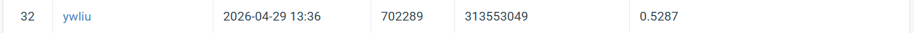

# NYCU Visual Recognition using Deep Learning 2026 — Homework 3

* **Student ID**: 313553049
* **Name**: 劉怡妏

## Introduction

This repository contains the implementation for HW3: **Instance Segmentation** on Hematoxylin and Eosin (H&E) stained histology images containing four cell-type classes (class1–class4).

The model fine-tunes a COCO-pretrained **Mask R-CNN v2** (`maskrcnn_resnet50_fpn_v2`, torchvision) with a ResNet-50 backbone and Feature Pyramid Network neck. Key domain adaptations include:

* EDA-derived custom RPN anchors calibrated to actual H&E cell sizes and aspect ratios
* Per-dataset image normalization (replacing ImageNet defaults)
* HED-space stain augmentation that simulates inter-scanner staining variation without corrupting biologically meaningful H&E color cues

## File Structure

```
.
├── train.py           # Training loop, model builder, val evaluation
├── dataset.py         # CellDataset, TestDataset, train/val split
├── infer.py           # Test inference → test-results.json + submission.zip
├── checkpoints/       # Saved model weights (best.pth, last.pth, epoch_*.pth)
├── logs/              # Per-epoch training logs (CSV)
└── hw3-data-release/
    ├── train/         # 209 training images (image.tif + classN.tif masks)
    ├── test_release/  # 101 test images
    └── test_image_name_to_ids.json
```

## Environment Setup

```bash
pip install torch torchvision --index-url https://download.pytorch.org/whl/cu118
pip install pycocotools scikit-image tifffile numpy tqdm
```

## Usage

### Training

```bash
python train.py
```

### Inference

```bash
python infer.py --checkpoint checkpoints/best.pth
```

Outputs `test-results.json` and `submission.zip` (ready to upload to CodaBench).

## Performance Snapshot

